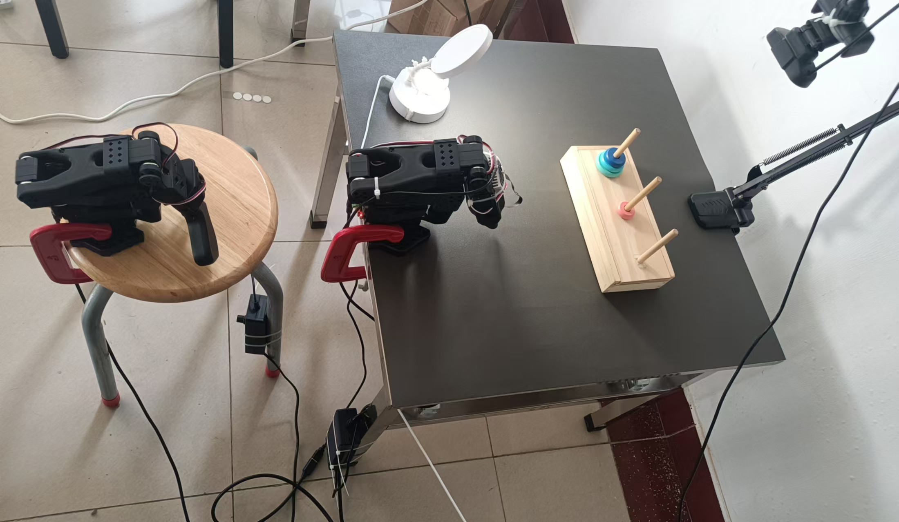
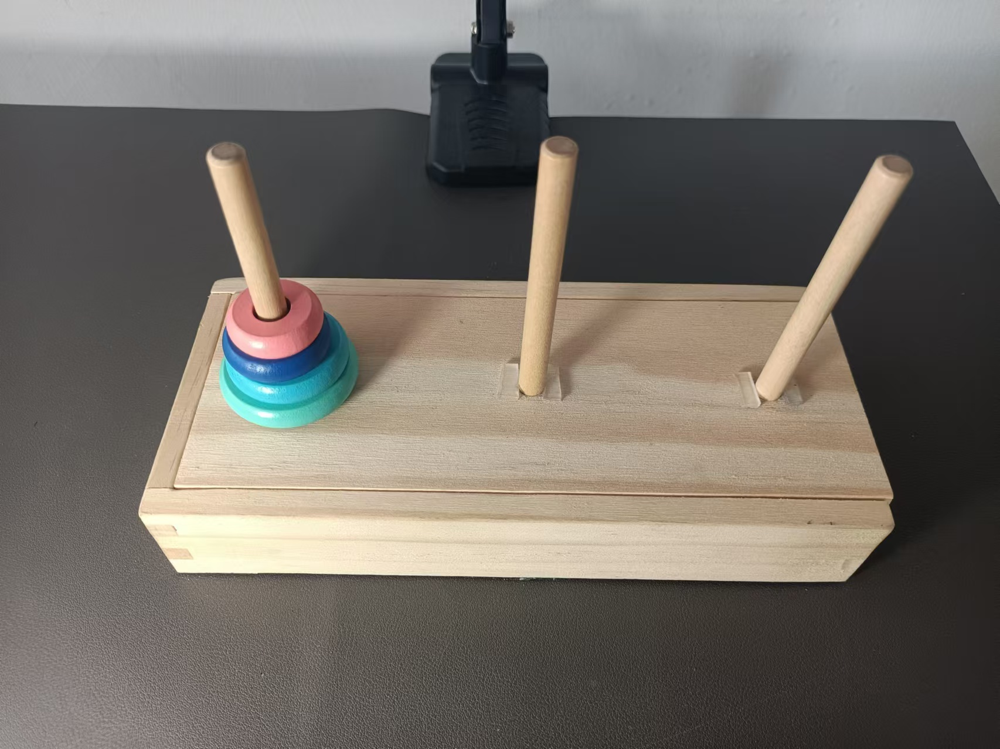
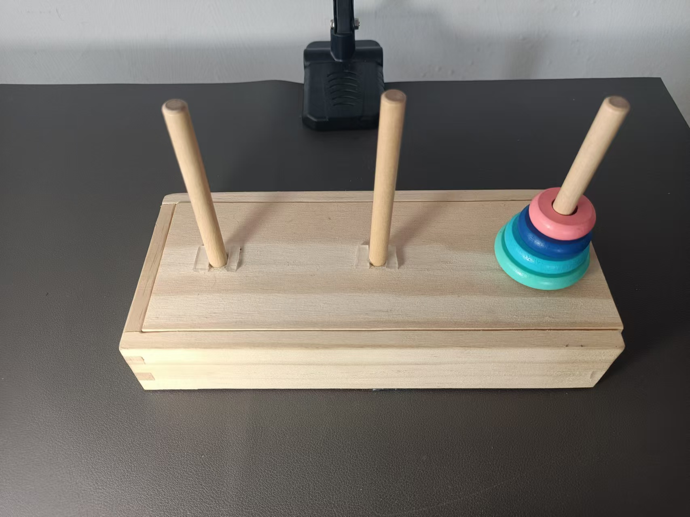

## 1. 项目概述

本项目基于 `2025/4/15` 的 `lerobot` 代码进行了精简、修正，目的是借助该框架实现**单机械臂完成汉诺塔任务**的全过程。

> **注意：** 本项目专用于 **so100 型号机械臂**，已移除对其他型号的官方支持与教程内容。

## 2. 功能特性

### 2.1 lerobot 相关

**完全本地化**：训练阶段取消从 `huggingface` 获取数据，数据集升级仅处理本地数据集

如需训练自定义模型完成其他任务，建议参考以下文档：

-  [use_so100](examples/6_use_so100.md) ：官方单臂教程，本地环境配置（有修正）、机械臂安装与校准；
-  [全流程指令](<notes/01. 全流程指令.md>)：简化官方教程，遥操、训练、验证的全流程指令；
- [Docker部署手册](<notes/03. Docker部署手册.md>)：本地环境配置失败的替代方案；
- [数据集工具](<notes/02. 数据集工具.md>) ：数据集升级，数据集信息重计算，特定数据集删除，数据集合并；
-  [服务器训练手册](<notes/04. 服务器训练手册.md>) ：可实现多任务自动化训练

### 2.2 汉诺塔游戏相关

- **分解动作训练**：针对汉诺塔任务每次移动训练一个模型。
- **汉诺塔算法**：递归算法，生成模型动作序列
- **接入大模型**：gpt分析初始状态图片，数字化初始状态，输入汉诺塔算法进行求解
- **模型合并**：尝试相同动作，不同状态数据集合并
- **自动化运行**：仿照lerobot框架，一次性加载所有模型，按顺序执行模型

自动化流程代码在文件夹  [autoHanoi](autoHanoi) 中

所有模型训练的详细信息记录于  [汉诺塔数据集状态](notes/05.汉诺塔数据集状态.md) 中

#### 实验环境：

#### 游戏目标：

完成 4 个圆盘的汉诺塔，从最左边柱子用 **15 次移动**转移至最右边柱子。

初始状态：

目标状态：

